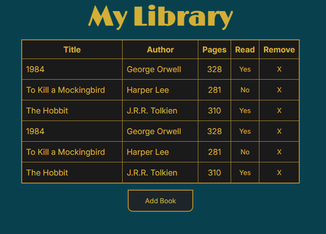

# Created as part of The Odin Project 
A simple library app that lets users track basic info about their books such as pages and whether they have read them or not. Created with the main goal of applying objects and object constructors in javascript. 

## To-Do:
- Use textcontent instead of innerHTML
- Remove table headings if library is empty
- Add sorting
- Backend

## Example
